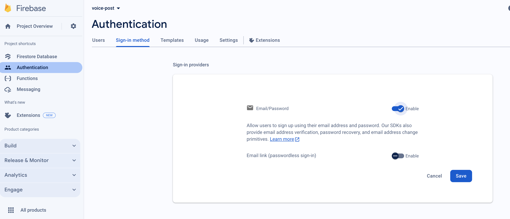

# Firebase Auth

In order to use Firebase Auth with this template, you ned to enable Email/Password authentication in the Firebase console

Here is a screenshot of where you can enable it. 

You can find the whole documentation [here](https://firebase.google.com/docs/auth/flutter/start)

