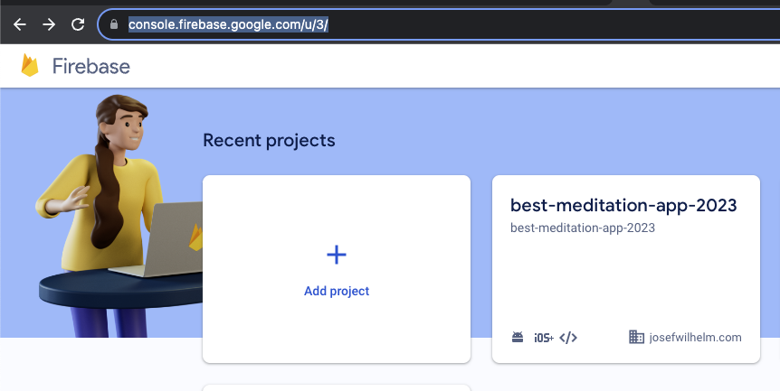
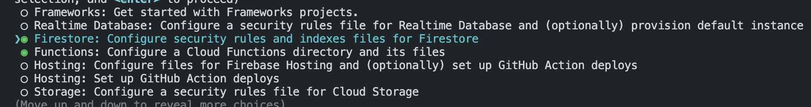
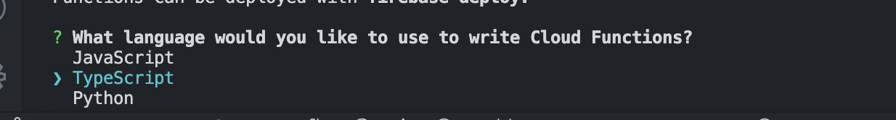

# Firebase setup

:::info
You need a Firebase account to use Firebase. You can create one [here](https://console.firebase.google.com/u/3/).
:::

In order to use Firebase with your app we need to setup a few things. 

You can find the whole documentation [here](https://firebase.google.com/docs/flutter/setup?platform=ios)

1. Install the Firebase CLI

    Follow the instructions [here](https://firebase.google.com/docs/cli#setup_update_cli)


2. We need to login to our Firebase account.

```
firebase login
````

3. As we will use the Firebase CLI to set up a lot things we need to install it 


```
dart pub global activate flutterfire_cli
```

:::info
Adjust your app identifiers in `ios/Runner.xcodeproj/project.pbxproj` and `android/app/build.gradle` before you continue.
:::

1. Now we can connect our project with Firebase 
```
flutterfire configure
```

1. Now you can create a new project or use an existing one. The following picture shows how it's done with a new project. 

```shell
user@users-macbook fast_flutter_template % flutterfire configure

i Found 8 Firebase projects.                                                                                                                                                                                                                                                        
✔ Select a Firebase project to configure your Flutter application with · <create a new project>                                                                                                                                                                                     
✔ Enter a project id for your new Firebase project (e.g. my-cool-project) · best-meditation-app-2023                                                                                                                                                                                
i New Firebase project best-meditation-app-2023 created successfully.                                                                                                                                                                                                               
✔ Which platforms should your configuration support (use arrow keys & space to select)? · android, ios, web                                                                                                                                                                         
i Firebase android app com.example.fast_flutter_template is not registered on Firebase project best-meditation-app-2023.                                                                                                                                                            
i Registered a new Firebase android app on Firebase project best-meditation-app-2023.                                                                                                                                                                                               
i Firebase ios app com.example.fastFlutterTemplate is not registered on Firebase project best-meditation-app-2023.                                                                                                                                                                  
i Registered a new Firebase ios app on Firebase project best-meditation-app-2023.                                                                                                                                                                                                   
i Firebase web app fast_flutter_template (web) is not registered on Firebase project best-meditation-app-2023.                                                                                                                                                                      
i Registered a new Firebase web app on Firebase project best-meditation-app-2023.                                                                                                                                                                                                   
✔ The files android/build.gradle & android/app/build.gradle will be updated to apply Firebase configuration and gradle build plugins. Do you want to continue? · yes                                                                                                                                                                                                         

```

6. If we now have a look at the [Console](https://console.firebase.google.com/u/3/) we will find the project there. 




--- 


## Functions & Firestore

Enable Firebase Functions and Firestore in the Firebase Console. 

Here is a guide for Firebase Functions: [Firebase Functions](https://firebase.google.com/docs/functions/get-started?gen=1st)

Here is a guide for Firestore: [Firestore](https://firebase.google.com/docs/firestore/quickstart?gen=1st)

Run 
```
firebase init
```

Select `Functions` and `Firestore` and select your project.



Follow the instructions. And choose typescript




### Deploy the functions

Now we can upload the functions to Firebase. 

```
firebase deploy --only functions
```


